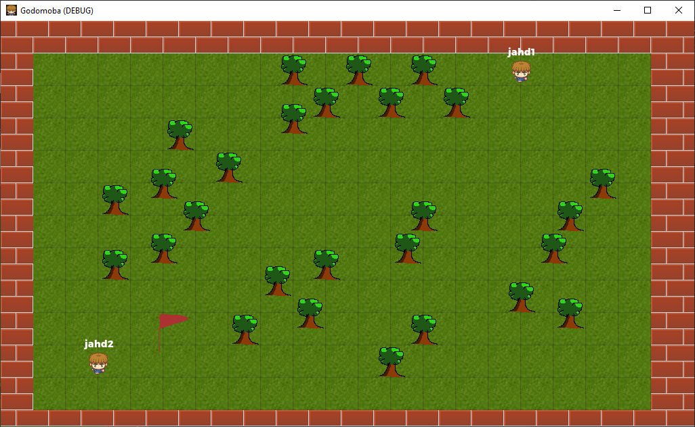

# Godomoba - MOBA built in Godot Game Engine

Open-source project to develop a Multiplayer Online Battle Arena (MOBA) game for the web (desktop and mobile), built on Godot Game Engine 3.4.

Similar to games such as LOL, Dota 2, HOS, Smite, Vainglory, Arena of Valor, HON. But it is going to be in 2D for simplicity.

Language: GDScript

Check out this demo on the asset library: Link Pending

Pull requests are welcome!

## Screenshots

### Task List

* Add pathfinding to the movement of the players (go around trees)
* Add static creeps
* Add melee attack mechanics to creeps
* Add ranged attack mechanics to creeps
* Add PVP (attack other players)
* Add health to creeps
* Add health to playes
* Add skills
* Add mana
* Add skills that require mana
* Add experience through last hit
* Add levelling up
* Add towers
* Build 3v3 world
* Build lobby
